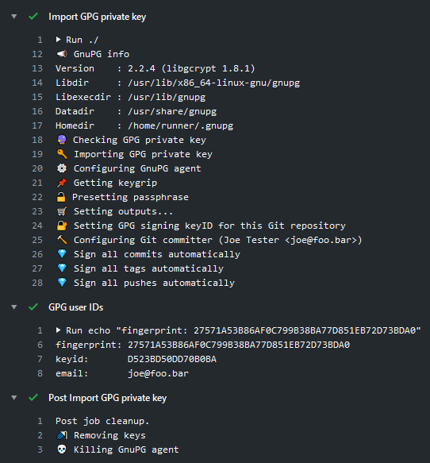

[](https://github.com/crazy-max/ghaction-import-gpg/releases/latest)
[](https://github.com/marketplace/actions/import-gpg)
[](https://github.com/crazy-max/ghaction-import-gpg/actions?workflow=test)
[](https://codecov.io/gh/crazy-max/ghaction-import-gpg)
[](https://github.com/sponsors/crazy-max)
[](https://www.paypal.me/crazyws)

## About

GitHub Action to easily import a GPG key.

If you are interested, [check out](https://github.com/crazy-max?tab=repositories&q=ghaction&type=source&language=&sort=) my other :octocat: GitHub Actions!



___

* [Features](#features)
* [Prerequisites](#prerequisites)
* [Usage](#usage)
  * [Workflow](#workflow)
  * [Sign commits](#sign-commits)
  * [Use a subkey](#use-a-subkey)
* [Customizing](#customizing)
  * [inputs](#inputs)
  * [outputs](#outputs)
* [Contributing](#contributing)
* [License](#license)

## Features

* Works on Linux, macOS and Windows [virtual environments](https://help.github.com/en/articles/virtual-environments-for-github-actions#supported-virtual-environments-and-hardware-resources)
* Allow to seed the internal cache of `gpg-agent` with provided passphrase
* Signing-only subkeys support
* Purge imported GPG key, cache information and kill agent from runner
* (Git) Enable signing for Git commits, tags and pushes
* (Git) Configure and check committer info against GPG key

## Prerequisites

First, [generate a GPG key](https://docs.github.com/en/github/authenticating-to-github/generating-a-new-gpg-key) and
export the GPG private key as an ASCII armored version to your clipboard:

```shell
# macOS
gpg --armor --export-secret-key joe@foo.bar | pbcopy

# Ubuntu (assuming GNU base64)
gpg --armor --export-secret-key joe@foo.bar -w0 | xclip

# Arch
gpg --armor --export-secret-key joe@foo.bar | xclip -selection clipboard -i

# FreeBSD (assuming BSD base64)
gpg --armor --export-secret-key joe@foo.bar | xclip
```

Paste your clipboard as a [`secret`](https://help.github.com/en/actions/configuring-and-managing-workflows/creating-and-storing-encrypted-secrets)
named `GPG_PRIVATE_KEY` for example. Create another secret with the `PASSPHRASE` if applicable.

## Usage

### Workflow

```yaml
name: import-gpg

on:
  push:
    branches: master

jobs:
  import-gpg:
    runs-on: ubuntu-latest
    steps:
      -
        name: Checkout
        uses: actions/checkout@v3
      -
        name: Import GPG key
        id: import_gpg
        uses: crazy-max/ghaction-import-gpg@v5
        with:
          gpg_private_key: ${{ secrets.GPG_PRIVATE_KEY }}
          passphrase: ${{ secrets.PASSPHRASE }}
      -
        name: List keys
        run: gpg -K
```

### Sign commits

```yaml
name: import-gpg

on:
  push:
    branches: master

jobs:
  sign-commit:
    runs-on: ubuntu-latest
    steps:
      -
        name: Checkout
        uses: actions/checkout@v3
      -
        name: Import GPG key
        uses: crazy-max/ghaction-import-gpg@v5
        with:
          gpg_private_key: ${{ secrets.GPG_PRIVATE_KEY }}
          passphrase: ${{ secrets.PASSPHRASE }}
          git_user_signingkey: true
          git_commit_gpgsign: true
      -
        name: Sign commit and push changes
        run: |
          echo foo > bar.txt
          git add .
          git commit -S -m "This commit is signed!"
          git push
```

### Use a subkey

With the input `fingerprint`, you can specify which one of the subkeys in a GPG key you want to use for signing.

```yaml
name: import-gpg

on:
  push:
    branches: master

jobs:
  import-gpg:
    runs-on: ubuntu-latest
    steps:
      -
        name: Checkout
        uses: actions/checkout@v3
      -
        name: Import GPG key
        id: import_gpg
        uses: crazy-max/ghaction-import-gpg@v5
        with:
          gpg_private_key: ${{ secrets.GPG_PRIVATE_KEY }}
          passphrase: ${{ secrets.PASSPHRASE }}
          fingerprint: "C17D11ADF199F12A30A0910F1F80449BE0B08CB8"
      -
        name: List keys
        run: gpg -K
```

For example, given this GPG key with a signing subkey:

```s
pub   ed25519 2021-09-24 [C]
      87F257B89CE462100BEC0FFE6071D218380FDCC8
      Keygrip = F5C3ABFAAB36B427FD98C4EDD0387E08EA1E8092
uid           [ unknown] Joe Bar <joe@bar.foo>
sub   ed25519 2021-09-24 [S]
      C17D11ADF199F12A30A0910F1F80449BE0B08CB8
      Keygrip = DEE0FC98F441519CA5DE5D79773CB29009695FEB
```

You can use the subkey with signing capability whose fingerprint is `C17D11ADF199F12A30A0910F1F80449BE0B08CB8`.

## Customizing

### inputs

Following inputs can be used as `step.with` keys

| Name                                  | Type    | Description                                    |
|---------------------------------------|---------|------------------------------------------------|
| `gpg_private_key`                     | String  | GPG private key exported as an ASCII armored version or its base64 encoding (**required**) |
| `passphrase`                          | String  | Passphrase of the GPG private key |
| `git_config_global`                   | Bool    | Set Git config global (default `false`) |
| `git_user_signingkey`                 | Bool    | Set GPG signing keyID for this Git repository (default `false`) |
| `git_commit_gpgsign`                  | Bool    | Sign all commits automatically. (default `false`) |
| `git_tag_gpgsign`                     | Bool    | Sign all tags automatically. (default `false`) |
| `git_push_gpgsign`                    | String  | Sign all pushes automatically. (default `if-asked`) |
| `git_committer_name`                  | String  | Set commit author's name (defaults to the name associated with the GPG key) |
| `git_committer_email`                 | String  | Set commit author's email (defaults to the email address associated with the GPG key) |
| `workdir`                             | String  | Working directory (below repository root) (default `.`) |
| `fingerprint`                         | String  | Specific fingerprint to use (subkey) |

> `git_user_signingkey` needs to be enabled for `git_commit_gpgsign`, `git_tag_gpgsign`,
> `git_push_gpgsign`, `git_committer_name`, `git_committer_email` inputs.

### outputs

Following outputs are available

| Name          | Type    | Description                           |
|---------------|---------|---------------------------------------|
| `fingerprint` | String  | Fingerprint of the GPG key (recommended as [user ID](https://www.gnupg.org/documentation/manuals/gnupg/Specify-a-User-ID.html)) |
| `keyid`       | String  | Low 64 bits of the X.509 certificate SHA-1 fingerprint |
| `name`        | String  | Name associated with the GPG key       |
| `email`       | String  | Email address associated with the GPG key |

## Contributing

Want to contribute? Awesome! The most basic way to show your support is to star the project, or to raise issues. If
you want to open a pull request, please read the [contributing guidelines](.github/CONTRIBUTING.md).

You can also support this project by [**becoming a sponsor on GitHub**](https://github.com/sponsors/crazy-max) or by
making a [Paypal donation](https://www.paypal.me/crazyws) to ensure this journey continues indefinitely!

Thanks again for your support, it is much appreciated! :pray:

## License

MIT. See `LICENSE` for more details.
