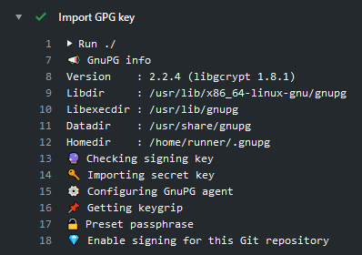

[](https://github.com/crazy-max/ghaction-import-gpg/releases/latest)
[](https://github.com/marketplace/actions/import-gpg)
[](https://github.com/crazy-max/ghaction-import-gpg/actions?workflow=test)
[](https://github.com/sponsors/crazy-max)
[](https://www.paypal.me/crazyws)

## About

GitHub Action to easily import your GPG key to sign commits and tags.

If you are interested, [check out](https://git.io/Je09Y) my other :octocat: GitHub Actions!



## Features

* Works on Linux and MacOS [virtual environments](https://help.github.com/en/articles/virtual-environments-for-github-actions#supported-virtual-environments-and-hardware-resources)
* Allow to seed the internal cache of `gpg-agent` with provided passphrase
* Enable signing for Git commits and tags
* Configure and check committer info against GPG key
* Purge imported GPG key, cache information and kill agent from runner

## Usage

On your local machine, export the GPG private key as an ASCII armored version:

```shell
gpg --armor --export-secret-key --output key.pgp joe@foo.bar
```

Copy the content of `key.pgp` file as a [`secret`](https://help.github.com/en/actions/configuring-and-managing-workflows/creating-and-storing-encrypted-secrets) named `SIGNING_KEY` for example. Create another secret with your `PASSPHRASE` if applicable.

```yaml
name: import-gpg

on:
  push:
    branches: master

jobs:
  import-gpg:
    runs-on: ubuntu-latest
    steps:
      -
        name: Checkout
        uses: actions/checkout@v2
      -
        name: Import GPG key
        uses: crazy-max/ghaction-import-gpg@v1
        with:
          git_gpgsign: true
        env:
          SIGNING_KEY: ${{ secrets.SIGNING_KEY }}
          PASSPHRASE: ${{ secrets.PASSPHRASE }}
```

## Customizing

### inputs

Following inputs can be used as `step.with` keys

| Name                   | Type    | Description                                              |
|------------------------|---------|----------------------------------------------------------|
| `git_gpgsign`          | Bool    | Enable signing for this Git repository (default `false`) |
| `git_committer_name`   | String  | Commit author's name (default [GITHUB_ACTOR](https://help.github.com/en/github/automating-your-workflow-with-github-actions/using-environment-variables#default-environment-variables) or `github-actions`) |
| `git_committer_email`  | String  | Commit author's email (default `<committer_name>@users.noreply.github.com`) |

### environment variables

Following environment variables can be used as `step.env` keys

| Name           | Description                           |
|----------------|---------------------------------------|
| `SIGNING_KEY`  | GPG private key exported as an ASCII armored version |
| `PASSPHRASE`   | Passphrase of your GPG key if setted for your `SIGNING_KEY` |

## How can I help?

All kinds of contributions are welcome :raised_hands:! The most basic way to show your support is to star :star2: the project, or to raise issues :speech_balloon: You can also support this project by [**becoming a sponsor on GitHub**](https://github.com/sponsors/crazy-max) :clap: or by making a [Paypal donation](https://www.paypal.me/crazyws) to ensure this journey continues indefinitely! :rocket:

Thanks again for your support, it is much appreciated! :pray:

## License

MIT. See `LICENSE` for more details.
